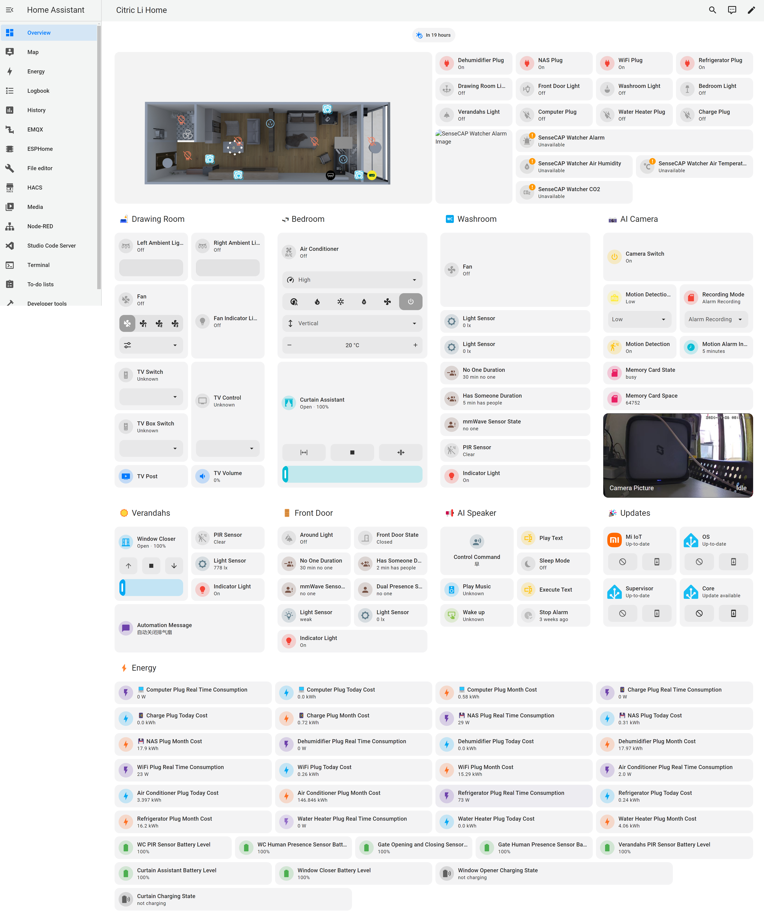

# My Home Assistant

Day 1 I decided on my whole house smart solution: https://www.reddit.com/r/homeassistant/comments/1fng5c9/smart_home_transformation_a_journey_to_wholehouse/

Day2 I made an ink-screen dashboard to display some of Home Assistant's sensors on: https://www.reddit.com/r/homeassistant/comments/1fo902f/smart_home_transformation_day_2_epaper_dashboard/

Day 3 I have designed a 3D floor plan for my room that I can control from Home Assistant, I love fancy things: https://www.reddit.com/r/homeassistant/comments/1fozgmd/smart_home_transformation_day_3_designing_a_3d/

